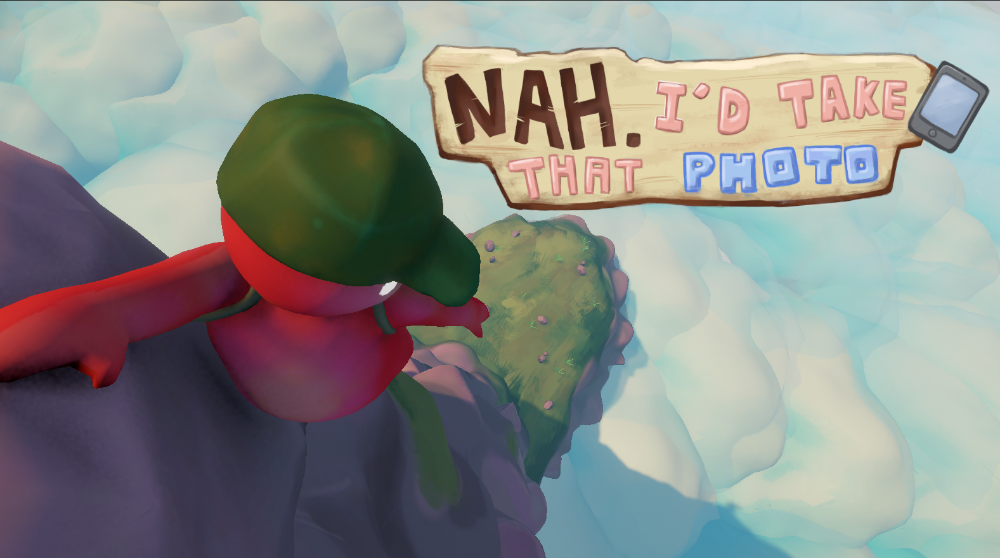
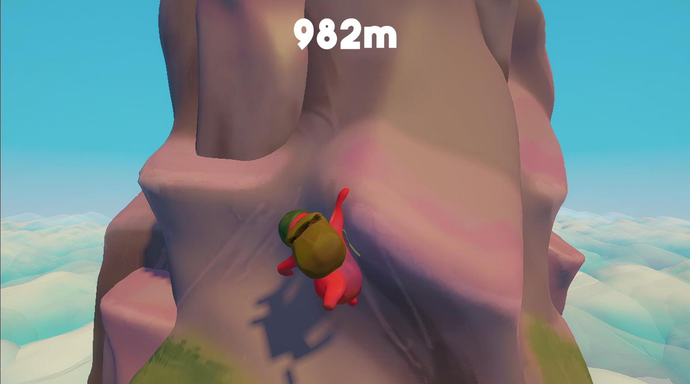
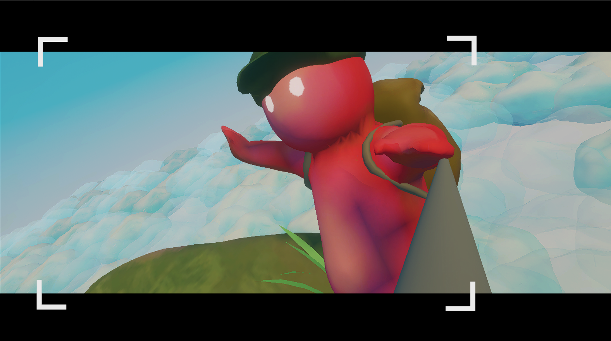
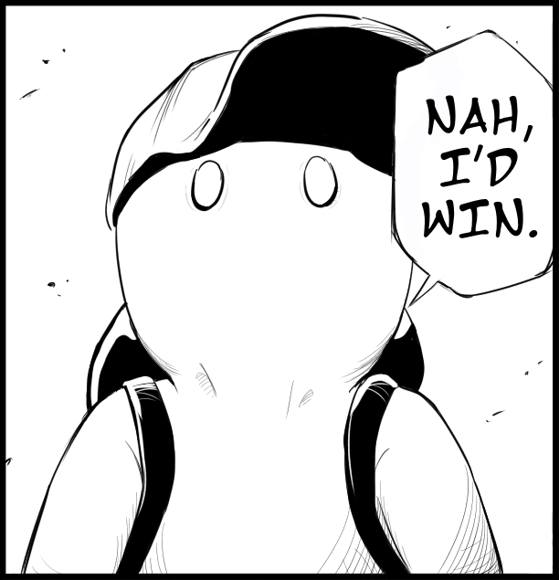

# NAH. I'd take that photo

     &nbsp;
     &nbsp;
     &nbsp;

## 🏔️ About
Take a selfie to upload to get likes! However, there's a catch. The location you've found is on top of a treacherous mountain. One false move and you'll tumble down hundreds of meters.
*
"Nah, I'd take that photo."
*

Embrace that idea and scale upon the mountain to show the world. You did it!

## 📷 Screenshots

<h2>Nah, what can possibly go wrong...</h2>

